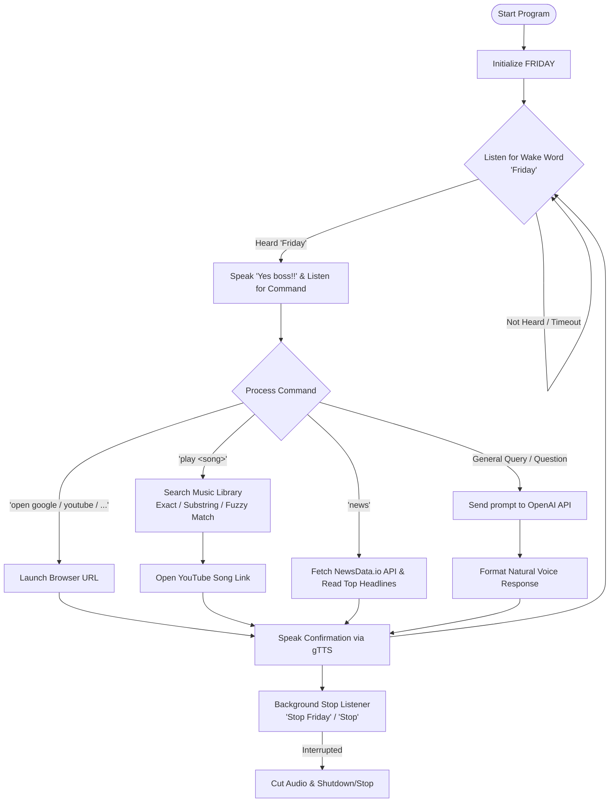

# 🎙️ FRIDAY - AI Voice Assistant (Python)

[](https://www.python.org/)
[](https://opensource.org/licenses/MIT)
[](https://openai.com/)
[](https://pypi.org/project/SpeechRecognition/)

**FRIDAY** is a smart, modular, and interactive voice assistant built in Python. Inspired by Tony Stark's iconic AI, FRIDAY can listen for wake words, answer real-time queries with OpenAI, play music using smart fuzzy matching, fetch real-time news headlines, launch favorite websites, and dynamically stop speaking upon voice interruption.

---

## 📑 Table of Contents

- [✨ Key Features](#-key-features)
- [🏗️ Architecture & Workflow](#️-architecture--workflow)
- [📁 Project Structure](#-project-structure)
- [⚙️ Prerequisites & Dependencies](#️-prerequisites--dependencies)
- [🚀 Quick Start & Installation](#-quick-start--installation)
- [🔑 API Keys Configuration](#-api-keys-configuration)
- [🗣️ Voice Commands & Usage](#️-voice-commands--usage)
- [🎵 Customizing the Music Library](#-customizing-the-music-library)
- [🛠️ Troubleshooting](#️-troubleshooting)
- [📜 License](#-license)

---

## ✨ Key Features

- 👂 **Wake Word Activation**: Responds to `"Friday"` to activate command listening.
- 🛑 **Real-Time Voice Interruption**: Uses background audio monitoring (`threading`) so saying `"Stop Friday"` or `"Stop"` immediately interrupts the assistant while it is speaking.
- 🧠 **AI-Powered Conversations**: Integrates OpenAI's modern API to deliver natural, concise, markdown-free voice answers (max 2 sentences).
- 🎵 **Smart Music Player**:
  - Exact matching, space-insensitive matching, and substring search.
  - **Fuzzy matching** fallback using `difflib` to match songs even with minor pronunciation or recognition differences.
  - Automatically launches the song in your default browser.
- 📰 **Live News Headlines**: Fetches the latest top news headlines from the **NewsData.io API**.
- 🌐 **Browser Automation**: Instantly launches frequently used websites (Google, YouTube, Instagram, LinkedIn).
- 🔊 **Dual Text-To-Speech Engines**:
  - High-quality online natural voice generation via **gTTS** (Google Text-to-Speech) + **Pygame Mixer**.
  - Fast offline voice synthesis option via **pyttsx3**.

---

## 🏗️ Architecture & Workflow



---

## 📁 Project Structure

```text
friday-voice-assistant-python/
│
├── main.py              # Main application loop, speech recognition, and command router
├── musicLibrary.py      # Dictionary mapping song names/keywords to YouTube URLs
├── client.py            # Standalone test script for OpenAI API queries
├── test_voice.py        # Standalone test script for pyttsx3 offline voice engine
├── requirements.txt     # Python package dependencies
├── README.md            # Project documentation and setup guide
└── .venv/               # Virtual environment directory (optional)
```

---

## ⚙️ Prerequisites & Dependencies

- **Python 3.8+**
- Working **Microphone** and **Speakers/Headphones**
- **Internet connection** (for Google Speech Recognition, gTTS, OpenAI, and NewsData APIs)

### Required Python Packages

| Package | Purpose |
| :--- | :--- |
| [`SpeechRecognition`](https://pypi.org/project/SpeechRecognition/) | Captures and converts speech to text |
| [`PyAudio`](https://pypi.org/project/PyAudio/) | PortAudio bindings for microphone input |
| [`gTTS`](https://pypi.org/project/gTTS/) | Google Text-to-Speech for realistic voice output |
| [`pygame`](https://pypi.org/project/pygame/) | Audio playback management and audio stream control |
| [`openai`](https://pypi.org/project/openai/) | Large Language Model queries and AI reasoning |
| [`requests`](https://pypi.org/project/requests/) | HTTP client for fetching live news feeds |
| [`pyttsx3`](https://pypi.org/project/pyttsx3/) | Offline text-to-speech fallback engine |

---

## 🚀 Quick Start & Installation

### 1. Clone the Repository
```bash
git clone https://github.com/your-username/friday-voice-assistant-python.git
cd friday-voice-assistant-python
```

### 2. Create and Activate a Virtual Environment
- **Windows (PowerShell):**
  ```powershell
  python -m venv .venv
  .\.venv\Scripts\Activate.ps1
  ```
- **macOS / Linux:**
  ```bash
  python3 -m venv .venv
  source .venv/bin/activate
  ```

### 3. Install Dependencies
```bash
pip install -r requirements.txt
```
*Or install manually:*
```bash
pip install SpeechRecognition gTTS pygame openai requests pyttsx3 PyAudio
```

> **Note for Windows Users**: If installing `pyaudio` fails with `pip install pyaudio`, install it via `pip install pipwin` followed by `pipwin install pyaudio`, or install the pre-compiled wheel.

---

## 🔑 API Keys Configuration

Open `main.py` and configure your API keys:

### 1. NewsData API Key
Sign up at [NewsData.io](https://newsdata.io/) to get your free API key, then update line 14:
```python
newsapikey = "YOUR_NEWSDATA_API_KEY"
```

### 2. OpenAI API Key
Obtain your API key from [OpenAI Platform](https://platform.openai.com/api-keys), then update line 116 in `main.py`:
```python
client = OpenAI(
    api_key="YOUR_OPENAI_API_KEY"
)
```

> 💡 **Best Practice**: You can also use environment variables or a `.env` file (with `python-dotenv`) to keep your API keys secure.

---

## 🗣️ Voice Commands & Usage

Run the assistant with:
```bash
python main.py
```

1. **Activate**: Say **`"Friday"`**.
2. **Response**: Friday will reply with **`"Yes boss!!"`**.
3. **Issue your command**:

| Command Category | Example Voice Prompt | Action Taken |
| :--- | :--- | :--- |
| **Browser Launch** | `"open google"` | Opens Google in your browser |
| **Browser Launch** | `"open youtube"` | Opens YouTube in your browser |
| **Browser Launch** | `"open instagram"` | Opens Instagram in your browser |
| **Browser Launch** | `"open linkedin"` | Opens LinkedIn in your browser |
| **Music Playback** | `"play levitating"` | Searches `musicLibrary.py` and opens the YouTube link |
| **Music Playback** | `"play abcdefu"` | Fuzzy-matches and plays the track |
| **Live News** | `"news"` or `"tell me the news"` | Reads out the top 10 latest headlines |
| **General AI Query** | `"what is quantum computing?"` | Uses OpenAI to speak a concise 2-sentence summary |
| **Stop / Interrupt** | `"stop friday"` or `"stop"` | Immediately halts speech and shuts down the assistant |

---

## 🎵 Customizing the Music Library

You can easily add your favorite tracks to `musicLibrary.py`:

```python
music = {
    "gabriela": "https://youtu.be/co-TFLbaZAE?si=ApiT_tKP5UXl-2sT",
    "illusion": "https://youtu.be/a9cyG_yfh1k?si=-OkSQHuTsX9x9zyS",
    "levitating": "https://youtu.be/TUVcZfQe-Kw?si=T7-nRuvxK8ZzP2sX",
    "copines": "https://youtu.be/EkGiGf8utCM?si=VsAze6GB92f30dfV",
    "abcdefu": "https://youtu.be/NaFd8ucHLuo?si=yJTpmUmdV_WKrQ2H",
    # Add your own entries:
    "starboy": "https://www.youtube.com/watch?v=34Na4j8AVgA"
}
```

---

## 🛠️ Troubleshooting

- **Microphone Not Detected / PyAudio Error**:
  - Ensure your microphone is set as the default input device in your OS settings.
  - On Windows, install PyAudio using `pip install pyaudio`. If an error occurs, try `pip install pipwin && pipwin install pyaudio`.
- **Speech Recognition Timeouts**:
  - Ensure you are in a low-noise environment.
  - Check your internet connectivity as Google Speech Recognition requires an active connection.
- **Audio File Locking (`temp.mp3`)**:
  - The script uses `pygame.mixer.music.unload()` to release file handles before deletion. If you encounter permission errors on Windows, ensure no external media player is holding onto `temp.mp3`.
- **OpenAI API Errors**:
  - Verify that your OpenAI API key is active and has sufficient quota/credits.

---

## 📜 License

This project is open-source and available under the [MIT License](LICENSE).
